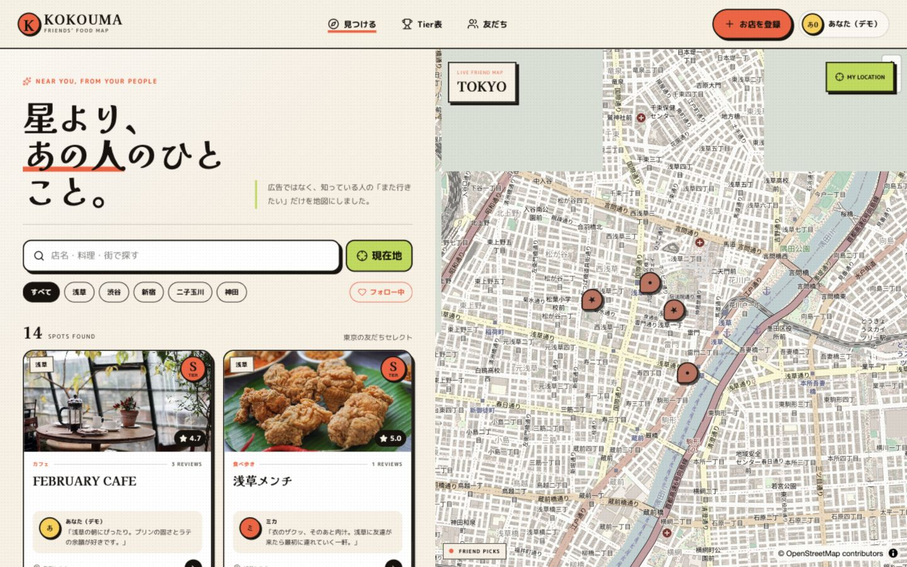
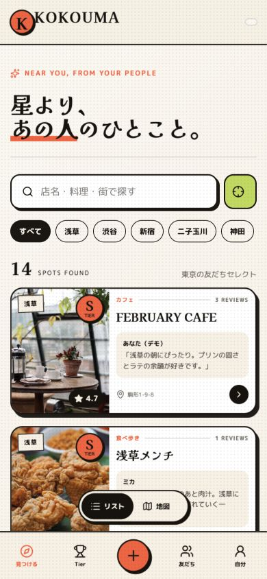

# KOKOUMA — 友だちの「ここ、うまい」を地図に。



KOKOUMAは、友だちや知り合いの「また行きたい」から次の一軒を見つけるソーシャルグルメマップです。**Global Build Week Community Event - Tokyo** 向けに、実動するフルスタックWebサービスとして制作しました。

**Live demo:** [https://kokouma.teto66.chatgpt.site](https://kokouma.teto66.chatgpt.site)

## What works

- 友だちのレビューとTierを重ねたインタラクティブ地図
- Google Maps共有リンクからの店舗登録と位置補正
- ID／パスワード認証、匿名閲覧、ワンタップの書き込み可能デモ
- 星1〜5、記述レビュー、S/A/B/C Tier表
- レビューごとの公開範囲（みんな／フォロー中／相互フォローのみ）
- プロフィール、フォロー、フィード絞り込み
- プロフィールQR生成とアプリ内カメラスキャン
- Cloudflare R2への店舗写真アップロード
- PC／スマホ対応、現在地、エリア検索
- Cloudflare D1への永続化と保護された初期データ

> `Jensen Huang — 非公式デモアカウント` は、2026年7月の来店報道を題材にした明示的なフィクションです。本人・NVIDIAとは関係なく、レビュー本文も架空であることをUI上に表示しています。

> `太田 裕雄 — 非公式デモアカウント` は、キオクシア株式会社の公式な役職情報をもとに人物名だけを使用したフィクションです。本人・キオクシアとは関係なく、来店事実やレビュー本文も架空です。

## Demo

[公開デモ](https://kokouma.teto66.chatgpt.site)のログイン画面にある **「ワンタップでデモを試す」** から、投稿・Tier・フォローを実際に保存できます。通常の新規登録も利用できます。



## Stack

- React 19 / TypeScript / vinext / Vite
- Cloudflare Workers / D1 / R2
- MapLibre GL JS / OpenStreetMap
- Drizzle ORM migrations
- QRCode / html5-qrcode

## Local development

```bash
npm install
npm run dev
```

`http://localhost:3000` を開きます。D1とR2はWranglerのローカル環境で動作します。

```bash
npm run typecheck
npm test
npm run build
```

## Data model

`users`、`credentials`、`sessions`、`follows`、`places`、`reviews`、`tier_entries`、`geocode_cache` をD1に保存します。画像本体はR2、参照キーはD1です。パスワードはPBKDF2-SHA256、セッションはハッシュ化した不透明トークンとHttpOnly Cookieを使用します。

## License

MIT
